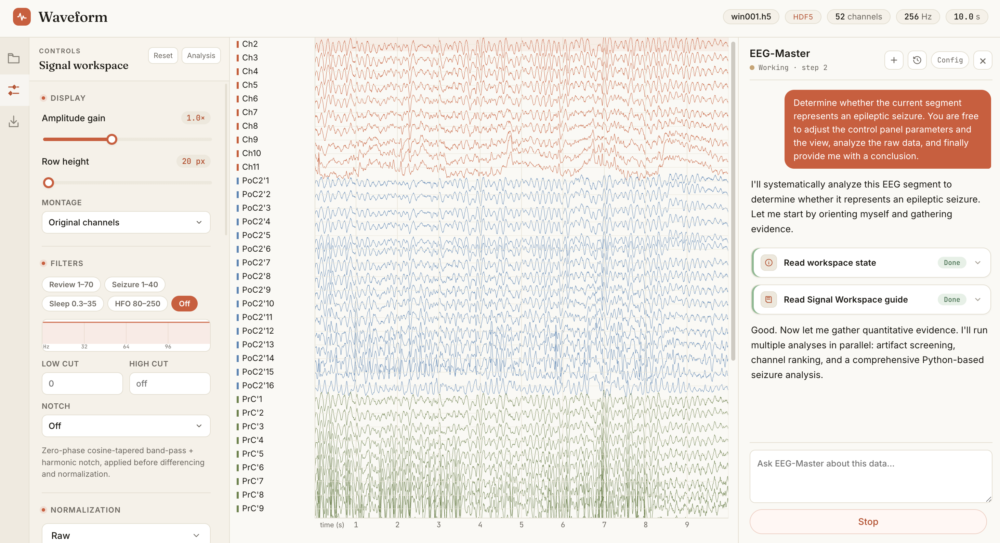

# Waveform

Waveform is a local workspace for reviewing EEG and iEEG recordings. It combines
an interactive signal viewer with an optional tool-using agent that can inspect
the same recording, run Python analyses, and produce focused signal views.



The viewer works without an AI provider. EEG-Master is an additional analysis
interface: it reads the current workspace, uses quantitative tools and rendered
signal images, and can operate the view while it investigates a question.

## Quick start

Waveform requires [uv](https://docs.astral.sh/uv/) and a modern desktop browser.
Python 3.11.15 and the Python dependencies are pinned in the repository.

```bash
./run.sh
```

Open [http://127.0.0.1:8000](http://127.0.0.1:8000), then choose a recording or
load the bundled example. On first run, `uv` creates the local `.venv` from
`uv.lock`; no frontend build is required.

The shell launcher targets macOS and Linux. On Windows, start the same service
from PowerShell with:

```powershell
uv run --frozen python -m uvicorn backend.app:app --host 127.0.0.1 --port 8000
```

## What is included

- A WebGL viewer for large multichannel recordings, with time navigation,
  channel scrolling, gain and row-height controls.
- Montage, band-pass and notch filtering, differencing, channel ordering, and
  several normalization modes.
- A project explorer for moving between authorized local recordings without
  uploading a directory to a remote service.
- Point and interval events, plus PNG, batch ZIP, CSV/JSON, HDF5, and EDF+
  exports.
- EEG-Master tools for workspace inspection, channel ranking, artifact
  screening, local Python analysis, and multi-scale signal rendering.

Agent event writes are deliberately conservative. Unless the current request
clearly asks for annotation, EEG-Master may report candidate times but cannot
add, edit, or delete events. File switching and downloads use the same explicit
authorization rule.

## Signal formats

| Format | Notes |
| --- | --- |
| HDF5 (`.h5`, `.hdf`, `.hdf5`) | A two-dimensional sample × channel dataset. `channel_labels`, `source_fs`, and `fs_target` are used when present. |
| EDF / EDF+ / BDF (`.edf`, `.bdf`) | Read with pyEDFlib. Annotation channels are omitted; lower-rate channels are resampled onto a common time grid. |

Decoding and export run in the local Python service. Interactive rendering and
most view operations stay in the browser. The bundled `win001.h5` is a
deidentified example; its separate data terms are in [DATA_LICENSE.md](DATA_LICENSE.md).

## Using EEG-Master

Open **EEG-Master → Config** and enter an API Base URL, API key, and model. No
provider is selected by default. For the OpenAI API, the Base URL is
`https://api.openai.com`.

The provider must support an OpenAI-compatible Chat Completions API with SSE
streaming and native multi-turn tool calls. Models that inspect generated signal
images must also accept data-URL `image_url` content. `GET /v1/models` is useful
for the model test button but is optional when a model ID is entered manually.
See [agent/README.md](agent/README.md) for the tool loop and provider contract.

The chat proxy does not send raw waveform arrays by default.
Workspace summaries and, when requested by the agent, rendered signal images or
Python figures are sent to the provider configured by the user.

## Development

Install the locked environment explicitly when working on the project:

```bash
uv sync --frozen
```

Run the test suites with:

```bash
npm test
uv run --frozen python -m unittest discover -s test -p 'test_*.py' -v
```

The main source areas are intentionally separated:

- `backend/` — signal readers, binary transport, rendering, and export routes
- `frontend/` — the viewer, workspace controls, and project explorer
- `agent/` — the model proxy, tool loop, workspace contract, and Python worker
- `test/` — Node and Python regression tests

## License

The application source is available under the [Apache License 2.0](LICENSE).
The bundled example is covered separately by [DATA_LICENSE.md](DATA_LICENSE.md).
The vendored Three.js module retains its upstream MIT notice.

## Safety and limitations

- Waveform is a research and engineering tool, not a medical device. Its output,
  including Agent conclusions and event candidates, must be reviewed by a
  qualified human and must not be used as the sole basis for diagnosis or care.
- Filtering, montage changes, normalization, resampling, and image rendering can
  alter the appearance of a waveform. Preserve the source recording and record
  the processing settings used for any interpretation or export.
- `run_python` executes model-written code in a separate process with a temporary
  working directory, time and output limits, and best-effort resource limits. It
  is not a hardened sandbox: code retains the local user's filesystem, network,
  and process permissions. Keep the service bound to `127.0.0.1` and do not
  expose the Agent endpoints to untrusted users or a public network.
- API credentials are stored in browser `sessionStorage` and forwarded by the
  local proxy to the Base URL entered by the user. Review the chosen provider's
  privacy and data-retention terms before allowing the Agent to inspect images.
