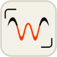

<div align="center">

<h1>&nbsp;&nbsp;Waveform</h1>

**A local workspace for EEG and iEEG — with an agent that can inspect the same recording.**

[](https://www.python.org/)
[](https://docs.astral.sh/uv/)
[](#what-is-waveform)
[](#using-eeg-master)
[](LICENSE)

Open a recording, inspect it in the browser, and bring in EEG-Master when you want
another set of tools. The agent works through the same signal workspace rather than
guessing from a screenshot or a detached summary.

**Clone the repository, run one command, and open the workspace in your browser.**

</div>

---

## What is Waveform?

Long, multichannel recordings often split the work across disconnected tools: a viewer
can show the traces but cannot run an investigation, while a script can read the samples
but does not know what the researcher is currently looking at. Waveform keeps those two
sides together.

The Viewer gives you direct control over time, channels, montage, filters, normalization,
events, and exports. EEG-Master can inspect the same recording, adjust the control panel
as part of its workflow, analyze the underlying samples, and generate full-recording and
focused-window signal views.


Want to see the agent's output without running the app first? Open the bundled
[EEG-Master example report](agent_example.html): it is a self-contained exported
HTML conversation showing the agent inspecting a 10-second EEG segment derived
from the open CHB-MIT dataset, calling tools, running Python, and producing a
structured report. On GitHub, download the file and open it locally for the
rendered view.

---

## Highlights

- **EEG visualization for medical learning.** Explore real EEG/iEEG waveforms with
  filters, montages, and time windows to build an intuitive understanding of signal patterns.
- **A focused workflow for research data.** Browse, clean, annotate, manage, and export
  long recordings in one workspace, keeping EEG data work more organized.
- **EEG AI Agent.** EEG-Master works from the current Viewer state to search signals,
  adjust views, run analysis, and produce traceable evidence.
- **EEG Skills.** Users can configure center-, project-, or dataset-specific priors and
  workflow prompts for different EEG contexts.

---

## Quick start

Waveform requires [uv](https://docs.astral.sh/uv/) and a modern desktop browser. Python
3.11 and all Python dependencies are pinned by the repository.

```bash
git clone https://github.com/akatsuky999/Waveform-EEG-AIStudio.git
cd Waveform-EEG-AIStudio
./run.sh
```

Open <http://127.0.0.1:8000>, then choose a recording or load the bundled example. On the
first run, `uv` creates the local environment from `uv.lock`; no frontend build is needed.

On Windows, start the same service from PowerShell:

```powershell
uv run --frozen python -m uvicorn backend.app:app --host 127.0.0.1 --port 8000
```

### Supported recordings

| Format | Notes |
| --- | --- |
| HDF5 (`.h5`, `.hdf`, `.hdf5`) | A two-dimensional `samples × channels` dataset. Channel labels and sampling-rate metadata are used when present. |
| EDF / EDF+ / BDF (`.edf`, `.bdf`) | Read with pyEDFlib. Annotation channels are omitted and lower-rate channels are resampled to a common time grid. |

The bundled `win001.h5` is a deidentified example covered by the separate
[data notice](DATA_NOTICE.md).

---

## Using EEG-Master

Open **EEG-Master → Config** and enter an API Base URL, API key, and model. Nothing is
configured by default. The provider must offer an OpenAI-compatible Chat Completions API
with SSE streaming and native multi-turn tool calls. Image input is needed when the agent
inspects rendered signal views.

For regular recordings, EEG-Master can work directly with the decoded signal workspace:
it may rank channels, inspect time ranges, run local Python, adjust the Viewer, and render
evidence images. For large recordings, it switches to a windowed workflow: search the
recording index, load only bounded time windows for exact analysis, then render short
windows for morphology review.

The provider receives workspace summaries, bounded tool results, and requested images, not
raw waveform arrays. Python runs locally. See [agent/README.md](agent/README.md) for the
tool loop and sandbox model, or open the self-contained
[EEG-Master exported report](agent_example.html) for a concrete example.

---

## License

Waveform source code is released under the [Apache License 2.0](LICENSE). The bundled
example recording is covered by a separate [data notice](DATA_NOTICE.md), and the
vendored Three.js module retains its upstream MIT notice.

---

## Limitations and safety

- **Not a medical device.** Waveform is a research and engineering tool. Agent conclusions
  and event candidates require qualified human review and must not be the sole basis for
  diagnosis or care.
- **Processing changes appearance.** Montage, filtering, normalization, differencing, and
  resampling can all change how a waveform looks. Preserve the source and record the
  settings behind any interpretation or export.
- **`run_python` is not a hardened sandbox.** Model-written code runs in a constrained local
  subprocess, but it retains the local user's filesystem, network, and process permissions.
  Keep the service on `127.0.0.1` and never expose Agent endpoints to untrusted users.
- **Your provider sees what you send.** API credentials are kept in browser `sessionStorage`
  and forwarded to the Base URL you configure. Review that provider's privacy and retention
  terms before sharing workspace context or rendered signal images.
